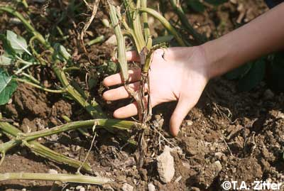
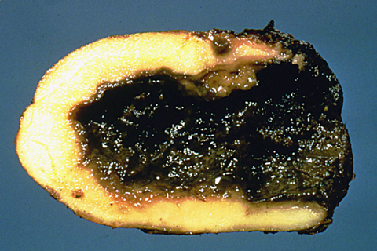
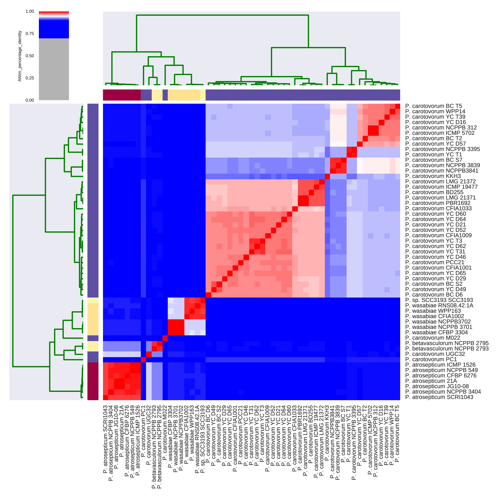
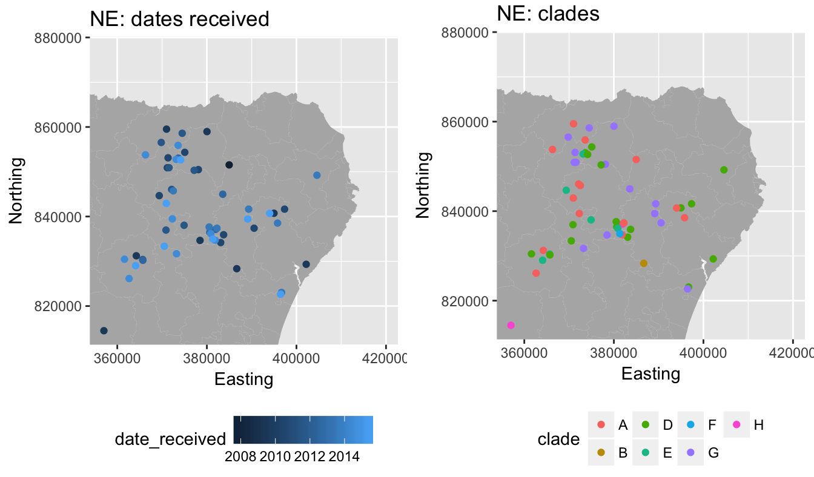
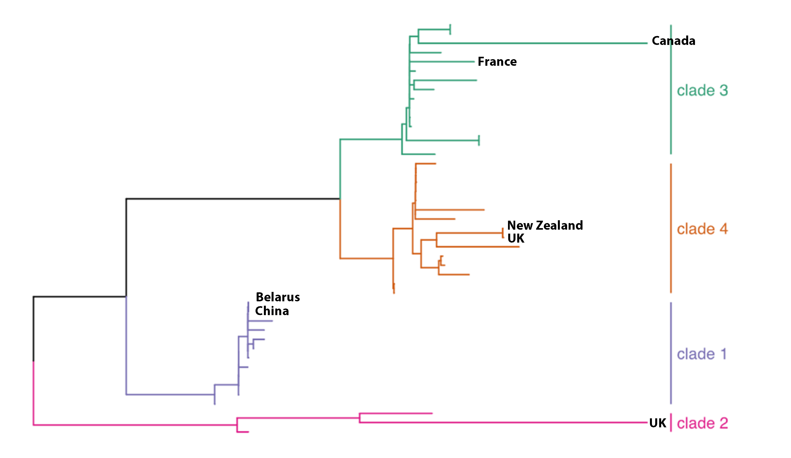
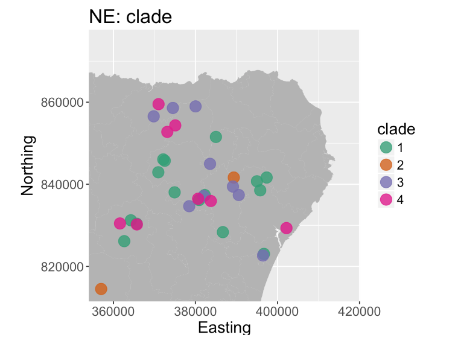

```{r setup, include=FALSE}
knitr::opts_chunk$set(echo = FALSE)
```

## *Pectobacterium* = blackleg

<div class="attention">
The bacterium *P. atrosepticum* (*Pba*) causes blackleg/softrot
</div>




- Major cause of downgrading and rejections

<div class="highlight">
**Where does infection come from?** We need to track *Pba*
</div>

- identifying pathogen origin enables control measures


## Overview

<div class="attention">
**We aim to make a historical, genomic atlas of Scottish *Pba*.**
</div>

- Long-term account of *Pba* in Scottish soils/farms
- Provide background for better detection of new pathogen introductions
- More precise and accurate diagnostics
    - improved tracking of *Pba*
    - enabe development of improved control measures

<div class="highlight">
**Total requested support: £8000** <br /><br />
To sequence ≈20% of our *Pba* isolate collection at JHI
</div>

- sequencing costs (100 isolates): £7000
- consumables: £1000


## *P. atrosepticum* diagnostics

<div class="attention">
***Pba* is a single species with closely-related isolates**
</div>

<center>

</center>

- Single molecular diagnostic for all *P. atrosepticum* (ECA primers)

<div class="highlight">
**We need more genome data to individualise isolates.**
</div>


## *P. atrosepticum* genomes: NCBI

<div class="attention">
**Seven complete genomes at NCBI: global distribution**
</div>

```{r}
library(knitr)
library(kableExtra)
df = data.frame(id=c("NCPPB 549", "ICMP 1526", "CFBP 6276", "NCPPB 3404", "SCRI 1043", "21A", "JG10-48"),
                origin=c("UK", "New Zealand", "France", "Canada", "UK", "Belarus", "China"))
kable(df)
```

## *P. atrosepticum* genomes: Scotland

<div class="attention">
**Sequenced ≈50 new *Pba* isolates from NE Scotland**
</div>

- ≈10X as many genomes as previously known

<center>

</center>

- Spanning six years, all known MLST clades


## We got a surprise…

<div class="attention">
**Four groups (clades) of *Pba* identified in Scotland (+NCBI isolates)**
</div>

<center>

</center>


## Another surprise…

<div class="attention">
***Pba* groups widespread across NE Scotland, no 'interbreeding'**
</div>

<center>

</center>

<div class="highlight">
**This raises several important questions…**
</div>

## Unanswered questions

- **Why are there *any* distinct groups of *Pba*?**
    - all *Pba* carried in on recent introductions?
    - *Pba* coexists naturally in mixed communities?
- **If *Pba* introduced from elsewhere…**
    - can we date earliest introduction?
    - can we identify nation/continent of origin?
- **If *Pba* naturally present…**
    - what is natural diversity across Scotland?
    - can we use this background to detect new introductions?
- **Can we develop more accurate diagnostics?**
  
<div class="highlight">
**We can answer these questions by sequencing our *Pba* collection**
</div>

## JHI Collection

<div class="attention">
**We hold ≈500 historical *Pba* isolates at JHI**
</div>

- Isolates from ≈1950 to present day
- Mostly from Scotland
    - also Europe, North & South America, Asia

<div class="highlight">
**By sequencing ≈100 isolates, we will make a historical atlas of Scottish *Pba*.**
</div>

- Long-term account of *Pba* in Scottish soils
- Provides background for better detection of new pathogen introductions
- Provides a basis for more precise and accurate diagnostics
    - enabling development of improved control measures
